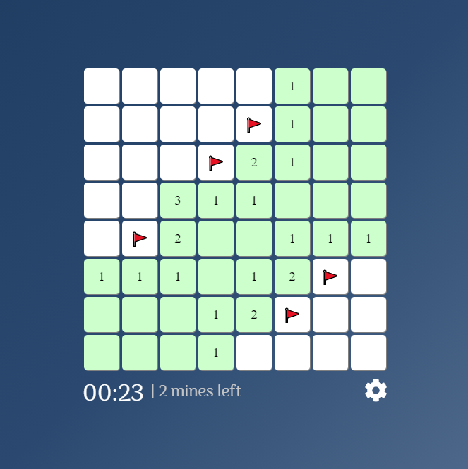
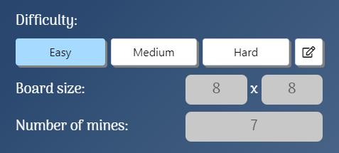
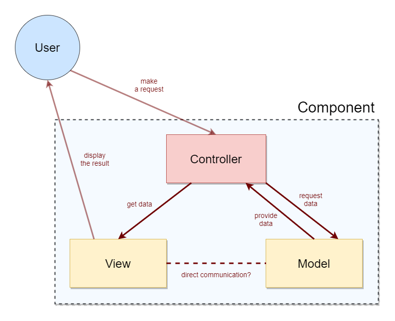

# minesweeper
 Simple MineSweeper game using vanilla JavaScript

<b>GAME RULES:</b>
* Click on a block to open it.
    * The first block you open will NEVER be a mine.
* The block can either:
    * Be empty,
    * Not have a mine, but have blocks around it with mines,
    * Have a mine.
* Clicking on an empty block opens it and opens all surrounding blocks.
    * Surrounding blocks are blocks that touch a block, including diagonals.
* Clicking on a block that doesn't have a mine opens it and displays a number of mines in blocks around it.
* Clicking a block with a mine means GAME OVER.
* Right-click a block to mark it if you believe that it has a mine.
* When you open all empty blocks, YOU WIN.
_______________________________________________________________________________________________________________

<b>GAME SETTINGS:</b> 
The game is designed dynamically and allows changing certain game parameters.
 The configuration is stored in a fake JSON database and can be changed using the game's interface.

* Board WIDTH
    * number of blocks horizontally
* Board HEIGHT
    * number of blocks vertically
* Number of mines
    * number of mines within the board determines the difficulty of solving the game

_______________________________________________________________________________________________________________

<b>DIFFICULTIES:</b> 
There are 3 sets of difficulties available - easy, medium and hard.
 Switching between them changes the size of the board (width & height) and the number of mines.
 You can also customize your own difficulty and change these values, however there are limits in order to keep the game's aesthetics.
 For example, you can't set the height of the board to 100 because that would fill up the whole screen.

* EASY
    * width: 8
    * height: 8
    * number of mines: 7
* MEDIUM
    * width: 10
    * height: 9
    * number of mines: 25
* HARD
    * width: 20
    * height: 12
    * number of mines: 80
* CUSTOM
    * width: 5-22
    * height: 5-12
    * number of mines:
        * min: 2
        * max: (width * height / 2) - 1
_______________________________________________________________________________________________________________

<b>GAME DESIGN:</b> 
The game follows the MVC (model-view-controller) structure model.
Every component has a:
* model
    * handles game logic
* view
    * handles game interface/drawing/DOM
* controller
    * utilizes both the model and the view and enables communication between them

Main game components are:
* block
* table
* game menu

Technical information:
* written is plain/vanilla HTML/CSS/JavaScript
* node package management (npm)
* configuration is stored in local JSON files
* no 3rd party frameworks
  

_______________________________________________________________________________________________________________

<b>DEPENDENCIES:</b> 
Tried to keep the project as independent as possible. Most of the dependencies are for the sake of aesthetics.
* <a href="https://fontawesome.com/how-to-use/on-the-web/setup/using-package-managers">FontAwesome</a>
    * for various icons/svgs
* <a href="https://www.npmjs.com/package/fireworks-js">Fireworks-JS</a>
    * for celebration when you win the game!
* <a href="https://webpack.js.org">Webpack & webpack-cli</a>
    * for module bundling
_______________________________________________________________________________________________________________

<b>NOTES:</b>
  * For a simple project like this, perhaps there's no need for a complex structure like MVC, but this was a practice project and the goal was to build a scalable/expandable game.
  * Generally in the MVC model, the view isn't supposed to have direct contact with the model.
   The communication is supposed to happen using the controller. However, in this project, I didn't always follow this rule for simplicity reasons.
  * The maximum number of mines on a board is determined in a very specific way, <h2>(width * height / 2) - 1,</h2>and it's for a reason.
   The first rule of the game says that the first block you open will never have a mine.
   But under the hood, the game logic is designed so that the blocks around the first block will ALSO never have mines.
   So while testing different values for the board width, height and number of mines, I ran into a scenario where the number of mines would be 20 and a 5x5 board.
   This seems OK at first, but when you open a block in the center, it sets that block and 8 surrounding ones to be non-mines.
   This means that there are 25 - 9 = 16 blocks left. But you set the number of mines to 20.
   This would break the game and put it into an infinite loop of trying to place a mine.