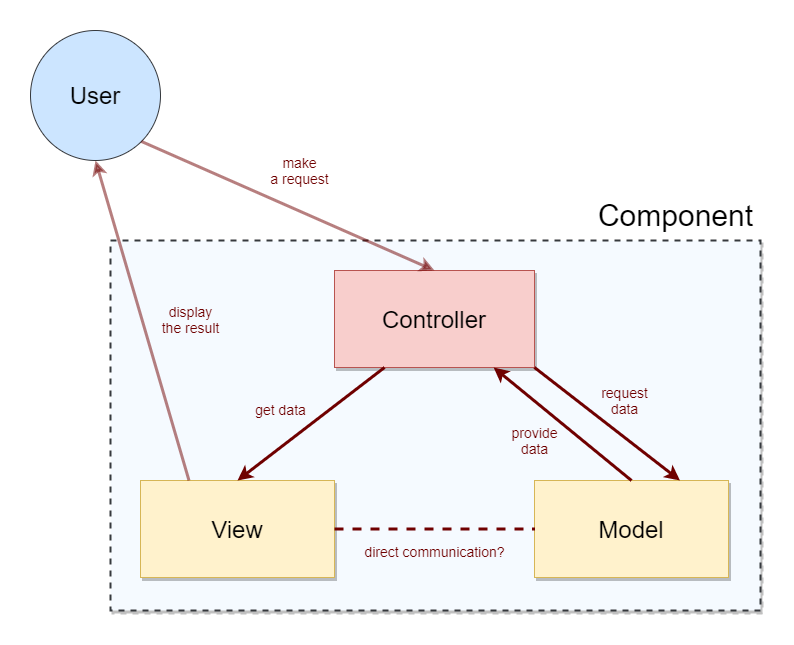

# minesweeper
 Simple MineSweeper game using vanilla JavaScript
_______________________________________________________________________________________________________________

<b>GAME RULES:</b>
* Click on a block to open it.
    * The first block you click will NEVER be a mine.
* The block can either:
    * Be empty,
    * Not have a mine, but have blocks around it with mines,
    * Have a mine.
* Clicking on an empty block opens it and opens all surrounding blocks.
    * Surrounding blocks are blocks that touch a block, including diagonals.
* Clicking on a block that doesn't have a mine opens it and displays a number of mines in blocks around it
* Clicking a block with a mine in it means GAME OVER.
* Right-click a block to mark it if you believe that it has a mine.
* When you open all blocks without mines, YOU WIN.
_______________________________________________________________________________________________________________

<b>GAME SETTINGS:</b>
The game is designed dynamically and allows changing certain game parameters.
The configuration is stored in a fake JSON database (file ./config/config.json)
and can be changed either manually or using the game's interface.

* Board WIDTH
    * number of blocks horizontally
* Board HEIGHT
    * number of blocks vertically
* Number of mines
    * number of mines within the board determines the difficulty of solving the game
    

_______________________________________________________________________________________________________________

<b>GAME DESIGN:</b>
The game follows the MVC (model-view-controller) structure model.
Every component has a:
* model
    * handles game logic
* view
    * handles game interface/drawing/DOM
* controller
    * utilizes both the model and the view and enables communication between them

Main game components are:
  * block
  * table
  * game menu

Technical information:
  * written is plain/vanilla HTML/CSS/JavaScript
  * uses a fake JSON database to read game settings
  * no 3rd party frameworks
  

_______________________________________________________________________________________________________________

<b>NOTES:</b>
  * For a simple project like this, perhaps there's no need for a complex structure like MVC,
but this was a practice project and the goal was to build a scalable/expandable game.
  * Generally in the MVC model, the view isn't supposed to have direct contact with the model.
The communication is supposed to happen using the controller. However, in this project,
I didn't always follow this rule for simplicity reasons.